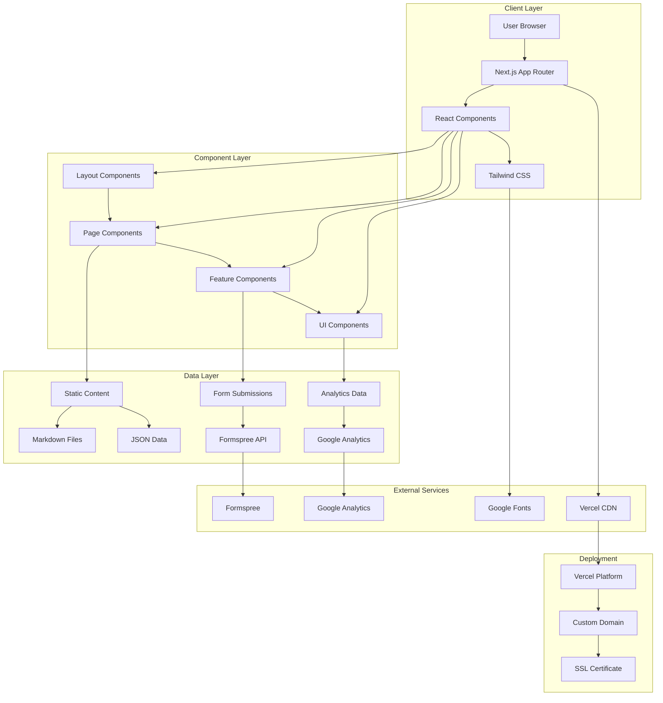
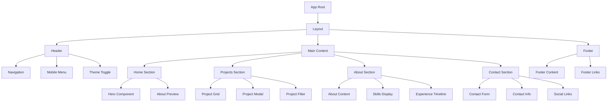

# Portfolio Website Design

## Architecture Overview

### System Architecture


### Component Hierarchy


## Key Components and Responsibilities

### Layout Components
- **Header**: Navigation menu, logo, mobile menu toggle, theme switcher
- **Footer**: Contact information, social media links, copyright, additional navigation
- **Layout**: Main wrapper with responsive grid system

### Page Components
- **Home**: Hero section, about preview, featured projects
- **Projects**: Full project showcase with filtering and modal details
- **About**: Detailed personal and professional information
- **Contact**: Contact form and alternative contact methods

### Feature Components
- **ProjectCard**: Individual project display with thumbnail and metadata
- **ProjectModal**: Detailed project view with full description and media
- **ContactForm**: Form handling with validation and submission
- **Navigation**: Responsive navigation with smooth scrolling
- **ThemeToggle**: Dark/light mode switching

### UI Components
- **Button**: Reusable button component with variants
- **Input**: Form input components with validation states
- **Card**: Content card component for projects and sections
- **Modal**: Overlay component for project details
- **Loading**: Loading states and spinners

## Data Architecture

### Content Management
- **Static Content**: Markdown files for easy content updates
- **Project Data**: JSON files with structured project information
- **Configuration**: Environment variables for external services

### Data Models

#### Project Data Structure
```typescript
interface Project {
  id: string;
  title: string;
  description: string;
  longDescription: string;
  technologies: string[];
  category: 'frontend' | 'fullstack' | 'mobile' | 'design' | 'opensource';
  images: {
    thumbnail: string;
    screenshots: string[];
    hero?: string;
  };
  links: {
    demo?: string;
    github: string;
    caseStudy?: string;
  };
  features: string[];
  challenges: string[];
  results?: string[];
  date: string;
  status: 'completed' | 'in-progress' | 'archived';
  featured: boolean;
}
```

#### Contact Form Data
```typescript
interface ContactFormData {
  name: string;
  email: string;
  subject: string;
  message: string;
  phone?: string;
  company?: string;
}
```

#### Navigation Structure
```typescript
interface NavigationItem {
  label: string;
  href: string;
  icon?: string;
  external?: boolean;
}
```

## Technology Stack Integration

### Frontend Framework
- **Next.js 14**: App Router for modern React patterns
- **React 18**: Component-based architecture with hooks
- **TypeScript**: Type safety and better developer experience

### Styling System
- **Tailwind CSS**: Utility-first CSS framework
- **Custom Design System**: Consistent colors, typography, and spacing
- **Responsive Design**: Mobile-first approach with breakpoints

### External Integrations
- **Formspree**: Form submission handling
- **Google Analytics**: Visitor tracking and insights
- **Google Fonts**: Typography (Inter, JetBrains Mono)

### Performance Optimizations
- **Image Optimization**: Next.js Image component with lazy loading
- **Code Splitting**: Automatic code splitting by Next.js
- **CDN**: Vercel Edge Network for global content delivery
- **Caching**: Static generation with ISR for dynamic content

## Design System

### Color Palette
```css
:root {
  /* Light Theme */
  --primary: #3b82f6;
  --primary-dark: #2563eb;
  --secondary: #64748b;
  --accent: #f59e0b;
  --background: #ffffff;
  --surface: #f8fafc;
  --text-primary: #1e293b;
  --text-secondary: #64748b;
  --border: #e2e8f0;
  --success: #10b981;
  --error: #ef4444;
  --warning: #f59e0b;
}

[data-theme="dark"] {
  /* Dark Theme */
  --primary: #60a5fa;
  --primary-dark: #3b82f6;
  --secondary: #94a3b8;
  --accent: #fbbf24;
  --background: #0f172a;
  --surface: #1e293b;
  --text-primary: #f1f5f9;
  --text-secondary: #94a3b8;
  --border: #334155;
  --success: #34d399;
  --error: #f87171;
  --warning: #fbbf24;
}
```

### Typography Scale
```css
/* Font Families */
--font-primary: 'Inter', system-ui, sans-serif;
--font-mono: 'JetBrains Mono', 'Fira Code', monospace;

/* Font Sizes */
--text-xs: 0.75rem;    /* 12px */
--text-sm: 0.875rem;   /* 14px */
--text-base: 1rem;     /* 16px */
--text-lg: 1.125rem;   /* 18px */
--text-xl: 1.25rem;    /* 20px */
--text-2xl: 1.5rem;    /* 24px */
--text-3xl: 1.875rem;  /* 30px */
--text-4xl: 2.25rem;   /* 36px */
--text-5xl: 3rem;      /* 48px */
```

### Spacing System
```css
/* Spacing Scale */
--space-1: 0.25rem;   /* 4px */
--space-2: 0.5rem;    /* 8px */
--space-3: 0.75rem;   /* 12px */
--space-4: 1rem;      /* 16px */
--space-6: 1.5rem;    /* 24px */
--space-8: 2rem;      /* 32px */
--space-12: 3rem;     /* 48px */
--space-16: 4rem;     /* 64px */
--space-24: 6rem;     /* 96px */
```

## Responsive Design Strategy

### Breakpoints
```css
/* Mobile First Approach */
sm: 640px;   /* Small devices */
md: 768px;   /* Medium devices */
lg: 1024px;  /* Large devices */
xl: 1280px;  /* Extra large devices */
2xl: 1536px; /* 2X large devices */
```

### Layout Patterns
- **Mobile**: Single column, stacked layout
- **Tablet**: Two-column grid where appropriate
- **Desktop**: Multi-column grid with optimal spacing
- **Touch Targets**: Minimum 44px for mobile interaction

## Accessibility Implementation

### WCAG 2.1 AA Compliance
- **Color Contrast**: Minimum 4.5:1 ratio for normal text
- **Keyboard Navigation**: Full keyboard accessibility
- **Screen Reader Support**: Proper ARIA labels and semantic HTML
- **Focus Management**: Clear focus indicators and logical tab order

### Implementation Guidelines
- Use semantic HTML elements (`<nav>`, `<main>`, `<section>`)
- Provide alt text for all images
- Ensure sufficient color contrast ratios
- Implement skip links for keyboard users
- Use proper heading hierarchy (h1-h6)

## Performance Requirements

### Core Web Vitals Targets
- **LCP (Largest Contentful Paint)**: < 2.5 seconds
- **FID (First Input Delay)**: < 100 milliseconds
- **CLS (Cumulative Layout Shift)**: < 0.1

### Optimization Strategies
- **Image Optimization**: WebP format with fallbacks
- **Code Splitting**: Route-based and component-based splitting
- **Lazy Loading**: Images and non-critical components
- **Caching**: Static assets with long-term caching
- **Compression**: Gzip/Brotli compression for text assets

## Security Considerations

### Data Protection
- **Form Validation**: Client-side and server-side validation
- **CSRF Protection**: Token-based protection for forms
- **Rate Limiting**: Prevent spam and abuse
- **HTTPS**: Secure communication for all requests

### Privacy Compliance
- **GDPR**: Cookie consent and data processing transparency
- **Analytics**: Privacy-focused Google Analytics configuration
- **Form Data**: Secure handling and retention policies