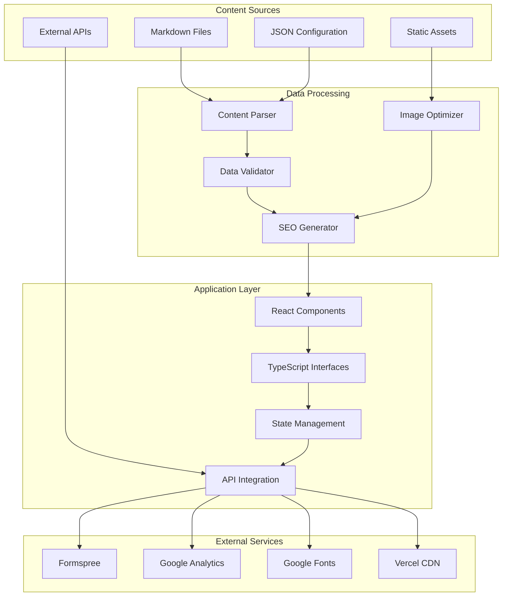

# Data Models & Content Management

## Overview

This document defines the data models, content management strategy, and data flow patterns for the portfolio website. It covers project data structures, content organization, and integration with external services.

## Data Architecture

### Content Management Strategy


## Core Data Models

### Project Data Model
```typescript
interface Project {
  // Basic Information
  id: string;
  title: string;
  slug: string;
  description: string;
  longDescription: string;
  
  // Categorization
  category: ProjectCategory;
  tags: string[];
  technologies: Technology[];
  
  // Visual Assets
  images: ProjectImages;
  
  // Links and Resources
  links: ProjectLinks;
  
  // Content Details
  features: string[];
  challenges: string[];
  results?: ProjectResult[];
  
  // Metadata
  date: ProjectDate;
  status: ProjectStatus;
  featured: boolean;
  
  // SEO
  seo: ProjectSEO;
}

interface ProjectCategory {
  id: string;
  name: string;
  color: string;
  icon: string;
  description?: string;
}

interface Technology {
  name: string;
  version?: string;
  icon?: string;
  category: 'frontend' | 'backend' | 'database' | 'tool' | 'other';
}

interface ProjectImages {
  thumbnail: ImageAsset;
  hero?: ImageAsset;
  screenshots: ImageAsset[];
  gallery?: ImageAsset[];
}

interface ImageAsset {
  src: string;
  alt: string;
  width: number;
  height: number;
  format: 'jpg' | 'png' | 'webp' | 'svg';
  optimized?: boolean;
}

interface ProjectLinks {
  demo?: ExternalLink;
  github: ExternalLink;
  caseStudy?: InternalLink;
  documentation?: ExternalLink;
  video?: ExternalLink;
}

interface ExternalLink {
  url: string;
  label: string;
  external: true;
}

interface InternalLink {
  href: string;
  label: string;
  external: false;
}

interface ProjectResult {
  metric: string;
  value: string;
  description: string;
  icon?: string;
}

interface ProjectDate {
  start: string; // ISO date
  end?: string; // ISO date
  published: string; // ISO date
  updated?: string; // ISO date
}

type ProjectStatus = 'completed' | 'in-progress' | 'archived' | 'planned';

interface ProjectSEO {
  title: string;
  description: string;
  keywords: string[];
  ogImage?: string;
  structuredData?: object;
}
```

### About/Profile Data Model
```typescript
interface ProfileData {
  // Basic Information
  personal: PersonalInfo;
  professional: ProfessionalInfo;
  
  // Experience
  experience: ExperienceEntry[];
  
  // Skills
  skills: SkillsData;
  
  // Content
  content: ProfileContent;
  
  // SEO
  seo: ProfileSEO;
}

interface PersonalInfo {
  name: string;
  title: string;
  headline: string;
  bio: string;
  location: LocationInfo;
  profileImage: ImageAsset;
  availability: AvailabilityStatus;
}

interface ProfessionalInfo {
  summary: string;
  philosophy: string;
  specialties: string[];
  certifications?: Certification[];
  education?: EducationEntry[];
}

interface ExperienceEntry {
  id: string;
  company: CompanyInfo;
  role: RoleInfo;
  duration: Duration;
  description: string;
  achievements: Achievement[];
  technologies: Technology[];
  projects?: ProjectReference[];
}

interface CompanyInfo {
  name: string;
  website?: string;
  logo?: ImageAsset;
  industry?: string;
  size?: string;
}

interface RoleInfo {
  title: string;
  level: 'junior' | 'mid' | 'senior' | 'lead' | 'principal' | 'manager' | 'director';
  department?: string;
  teamSize?: number;
}

interface Duration {
  start: string; // ISO date
  end?: string; // ISO date
  current: boolean;
  duration?: string; // Human readable
}

interface Achievement {
  title: string;
  description: string;
  impact?: string;
  metrics?: Metric[];
}

interface Metric {
  name: string;
  value: string;
  unit?: string;
}

interface ProjectReference {
  projectId: string;
  role: string;
  description: string;
}

interface SkillsData {
  categories: SkillCategory[];
  proficiency: ProficiencyLevel[];
}

interface SkillCategory {
  id: string;
  name: string;
  icon: string;
  skills: Skill[];
}

interface Skill {
  name: string;
  level: ProficiencyLevel;
  yearsExperience?: number;
  lastUsed?: string; // ISO date
  projects?: string[]; // Project IDs
}

type ProficiencyLevel = 'beginner' | 'intermediate' | 'advanced' | 'expert';

interface LocationInfo {
  city: string;
  state?: string;
  country: string;
  timezone: string;
  coordinates?: {
    lat: number;
    lng: number;
  };
}

interface AvailabilityStatus {
  status: 'available' | 'busy' | 'unavailable';
  message?: string;
  nextAvailable?: string; // ISO date
}

interface Certification {
  name: string;
  issuer: string;
  date: string; // ISO date
  credentialId?: string;
  url?: string;
}

interface EducationEntry {
  institution: string;
  degree: string;
  field: string;
  startDate: string; // ISO date
  endDate?: string; // ISO date
  gpa?: number;
  achievements?: string[];
}

interface ProfileContent {
  introduction: string;
  philosophy: string;
  interests: Interest[];
  testimonials?: Testimonial[];
}

interface Interest {
  name: string;
  description?: string;
  icon?: string;
  category: 'hobby' | 'volunteer' | 'learning' | 'other';
}

interface Testimonial {
  quote: string;
  author: PersonInfo;
  role: string;
  company?: string;
  date: string; // ISO date
}

interface PersonInfo {
  name: string;
  title?: string;
  company?: string;
  photo?: ImageAsset;
  linkedin?: string;
}

interface ProfileSEO {
  title: string;
  description: string;
  keywords: string[];
  ogImage?: string;
  structuredData?: object;
}
```

### Contact Data Model
```typescript
interface ContactData {
  // Contact Information
  info: ContactInfo;
  
  // Form Configuration
  form: FormConfig;
  
  // Social Links
  social: SocialLink[];
  
  // Alternative Contact Methods
  alternatives: AlternativeContact[];
  
  // SEO
  seo: ContactSEO;
}

interface ContactInfo {
  email: ContactMethod;
  phone?: ContactMethod;
  location: LocationInfo;
  availability: AvailabilityStatus;
  responseTime: string;
}

interface ContactMethod {
  value: string;
  label: string;
  primary: boolean;
  verified?: boolean;
}

interface FormConfig {
  endpoint: string;
  fields: FormField[];
  validation: ValidationRules;
  messages: FormMessages;
  spamProtection: SpamProtection;
}

interface FormField {
  name: string;
  type: FormFieldType;
  label: string;
  placeholder?: string;
  required: boolean;
  validation?: FieldValidation;
  options?: FormFieldOption[];
}

type FormFieldType = 'text' | 'email' | 'tel' | 'textarea' | 'select' | 'checkbox' | 'radio';

interface FormFieldOption {
  value: string;
  label: string;
  disabled?: boolean;
}

interface FieldValidation {
  minLength?: number;
  maxLength?: number;
  pattern?: string;
  custom?: string; // Custom validation function name
}

interface ValidationRules {
  clientSide: boolean;
  serverSide: boolean;
  realTime: boolean;
  debounceMs?: number;
}

interface FormMessages {
  success: string;
  error: string;
  validation: ValidationMessages;
  loading: string;
}

interface ValidationMessages {
  required: string;
  email: string;
  minLength: string;
  maxLength: string;
  pattern: string;
  custom: { [key: string]: string };
}

interface SpamProtection {
  enabled: boolean;
  methods: ('honeypot' | 'recaptcha' | 'rateLimit')[];
  rateLimit?: {
    maxRequests: number;
    windowMs: number;
  };
}

interface SocialLink {
  platform: SocialPlatform;
  url: string;
  label: string;
  description?: string;
  icon: string;
  verified?: boolean;
  primary?: boolean;
}

type SocialPlatform = 'linkedin' | 'github' | 'twitter' | 'instagram' | 'youtube' | 'medium' | 'dribbble' | 'behance';

interface AlternativeContact {
  type: 'calendly' | 'whatsapp' | 'telegram' | 'discord' | 'other';
  url: string;
  label: string;
  description?: string;
  icon: string;
}

interface ContactSEO {
  title: string;
  description: string;
  keywords: string[];
  structuredData?: object;
}
```

### Navigation Data Model
```typescript
interface NavigationData {
  // Main Navigation
  main: NavigationItem[];
  
  // Footer Navigation
  footer: FooterNavigation;
  
  // Mobile Navigation
  mobile: MobileNavigation;
  
  // Breadcrumbs
  breadcrumbs: BreadcrumbConfig;
  
  // SEO
  seo: NavigationSEO;
}

interface NavigationItem {
  id: string;
  label: string;
  href: string;
  icon?: string;
  external: boolean;
  order: number;
  children?: NavigationItem[];
  badge?: NavigationBadge;
}

interface NavigationBadge {
  text: string;
  color: string;
  variant: 'solid' | 'outline' | 'soft';
}

interface FooterNavigation {
  brand: FooterBrand;
  sections: FooterSection[];
  legal: LegalLink[];
  social: SocialLink[];
}

interface FooterBrand {
  name: string;
  description: string;
  logo?: ImageAsset;
}

interface FooterSection {
  title: string;
  links: FooterLink[];
}

interface FooterLink {
  label: string;
  href: string;
  external: boolean;
}

interface LegalLink {
  label: string;
  href: string;
  required: boolean;
}

interface MobileNavigation {
  items: NavigationItem[];
  actions: MobileAction[];
}

interface MobileAction {
  type: 'button' | 'link';
  label: string;
  action: string;
  icon?: string;
}

interface BreadcrumbConfig {
  enabled: boolean;
  separator: string;
  homeLabel: string;
  maxItems?: number;
}

interface NavigationSEO {
  structuredData?: object;
}
```

## Content Management Strategy

### File Organization
```
content/
├── projects/
│   ├── index.json
│   ├── ecommerce-platform.json
│   ├── dashboard-app.json
│   └── mobile-app.json
├── profile/
│   ├── index.json
│   ├── experience.json
│   ├── skills.json
│   └── content.json
├── contact/
│   ├── config.json
│   └── messages.json
├── navigation/
│   └── config.json
└── assets/
    ├── images/
    │   ├── projects/
    │   ├── profile/
    │   └── icons/
    └── documents/
        └── resume.pdf
```

### Content Processing Pipeline
```typescript
interface ContentProcessor {
  // Load and parse content files
  loadContent<T>(path: string): Promise<T>;
  
  // Validate content against schemas
  validateContent<T>(content: T, schema: Schema): ValidationResult;
  
  // Process and transform content
  processContent<T>(content: T): ProcessedContent<T>;
  
  // Generate SEO metadata
  generateSEO(content: ProcessedContent<any>): SEOData;
  
  // Optimize images
  optimizeImages(images: ImageAsset[]): Promise<ImageAsset[]>;
}

interface ProcessedContent<T> {
  data: T;
  metadata: ContentMetadata;
  seo: SEOData;
  assets: AssetReference[];
}

interface ContentMetadata {
  lastModified: string;
  version: string;
  checksum: string;
  dependencies: string[];
}

interface AssetReference {
  type: 'image' | 'document' | 'video' | 'audio';
  path: string;
  optimized: boolean;
  size: number;
}
```

## Data Validation Schemas

### Project Schema Validation
```typescript
const projectSchema = {
  type: 'object',
  required: ['id', 'title', 'description', 'category', 'technologies', 'images', 'links', 'date', 'status'],
  properties: {
    id: { type: 'string', pattern: '^[a-z0-9-]+$' },
    title: { type: 'string', minLength: 1, maxLength: 100 },
    description: { type: 'string', minLength: 10, maxLength: 500 },
    longDescription: { type: 'string', minLength: 50, maxLength: 2000 },
    category: { $ref: '#/definitions/ProjectCategory' },
    tags: { type: 'array', items: { type: 'string' } },
    technologies: { type: 'array', items: { $ref: '#/definitions/Technology' } },
    images: { $ref: '#/definitions/ProjectImages' },
    links: { $ref: '#/definitions/ProjectLinks' },
    features: { type: 'array', items: { type: 'string' } },
    challenges: { type: 'array', items: { type: 'string' } },
    results: { type: 'array', items: { $ref: '#/definitions/ProjectResult' } },
    date: { $ref: '#/definitions/ProjectDate' },
    status: { type: 'string', enum: ['completed', 'in-progress', 'archived', 'planned'] },
    featured: { type: 'boolean' },
    seo: { $ref: '#/definitions/ProjectSEO' }
  }
};
```

### Profile Schema Validation
```typescript
const profileSchema = {
  type: 'object',
  required: ['personal', 'professional', 'experience', 'skills', 'content'],
  properties: {
    personal: { $ref: '#/definitions/PersonalInfo' },
    professional: { $ref: '#/definitions/ProfessionalInfo' },
    experience: { type: 'array', items: { $ref: '#/definitions/ExperienceEntry' } },
    skills: { $ref: '#/definitions/SkillsData' },
    content: { $ref: '#/definitions/ProfileContent' },
    seo: { $ref: '#/definitions/ProfileSEO' }
  }
};
```

## External Service Integration

### Formspree Integration
```typescript
interface FormspreeConfig {
  endpoint: string;
  fields: FormFieldMapping[];
  validation: FormspreeValidation;
  notifications: NotificationConfig;
}

interface FormFieldMapping {
  formField: string;
  formspreeField: string;
  required: boolean;
}

interface FormspreeValidation {
  clientSide: boolean;
  serverSide: boolean;
  customRules?: ValidationRule[];
}

interface NotificationConfig {
  email: EmailNotification;
  webhook?: WebhookNotification;
}

interface EmailNotification {
  enabled: boolean;
  recipients: string[];
  template?: string;
}

interface WebhookNotification {
  url: string;
  secret?: string;
  events: string[];
}
```

### Google Analytics Integration
```typescript
interface AnalyticsConfig {
  measurementId: string;
  events: AnalyticsEvent[];
  customDimensions: CustomDimension[];
  privacy: PrivacyConfig;
}

interface AnalyticsEvent {
  name: string;
  parameters: EventParameter[];
  triggers: EventTrigger[];
}

interface EventParameter {
  name: string;
  value: string | number;
  type: 'string' | 'number' | 'boolean';
}

interface EventTrigger {
  type: 'click' | 'scroll' | 'form_submit' | 'page_view' | 'custom';
  selector?: string;
  threshold?: number;
}

interface CustomDimension {
  index: number;
  name: string;
  scope: 'hit' | 'session' | 'user';
}

interface PrivacyConfig {
  anonymizeIp: boolean;
  respectDoNotTrack: boolean;
  cookieConsent: boolean;
  dataRetention: number; // days
}
```

## Performance Optimization

### Data Loading Strategy
```typescript
interface DataLoadingStrategy {
  // Static data loading
  staticData: {
    preload: boolean;
    cache: boolean;
    compression: boolean;
  };
  
  // Dynamic data loading
  dynamicData: {
    lazy: boolean;
    pagination: boolean;
    virtualization: boolean;
  };
  
  // Image optimization
  images: {
    lazy: boolean;
    responsive: boolean;
    webp: boolean;
    compression: number;
  };
}

// Implementation example
const loadProjects = async (): Promise<Project[]> => {
  // Load from static JSON files
  const projectsData = await import('../content/projects/index.json');
  
  // Validate data
  const validationResult = validateContent(projectsData.default, projectSchema);
  if (!validationResult.valid) {
    throw new Error(`Invalid project data: ${validationResult.errors}`);
  }
  
  // Process and optimize
  const processedProjects = await processProjects(projectsData.default);
  
  return processedProjects;
};
```

### Caching Strategy
```typescript
interface CacheConfig {
  // Browser caching
  browser: {
    staticAssets: string; // Cache-Control header
    apiResponses: string;
    images: string;
  };
  
  // CDN caching
  cdn: {
    enabled: boolean;
    ttl: number; // Time to live in seconds
    purge: boolean;
  };
  
  // Application caching
  application: {
    memory: boolean;
    localStorage: boolean;
    sessionStorage: boolean;
  };
}
```

## Content Migration and Backup

### Migration Strategy
```typescript
interface MigrationPlan {
  version: string;
  steps: MigrationStep[];
  rollback: RollbackPlan;
}

interface MigrationStep {
  id: string;
  description: string;
  action: MigrationAction;
  dependencies: string[];
}

interface MigrationAction {
  type: 'transform' | 'validate' | 'migrate' | 'cleanup';
  config: object;
}

interface RollbackPlan {
  steps: MigrationStep[];
  backupLocation: string;
}
```

### Backup Strategy
```typescript
interface BackupConfig {
  // Automated backups
  automated: {
    enabled: boolean;
    frequency: 'daily' | 'weekly' | 'monthly';
    retention: number; // days
    location: BackupLocation[];
  };
  
  // Manual backups
  manual: {
    enabled: boolean;
    triggers: string[];
  };
  
  // Content versioning
  versioning: {
    enabled: boolean;
    maxVersions: number;
    autoCommit: boolean;
  };
}

interface BackupLocation {
  type: 'local' | 'cloud' | 'git';
  path: string;
  credentials?: object;
}
```

## Testing Strategy

### Data Validation Testing
```typescript
describe('Data Models', () => {
  describe('Project Data', () => {
    it('should validate project schema', () => {
      const project = loadProject('ecommerce-platform');
      const result = validateContent(project, projectSchema);
      expect(result.valid).toBe(true);
    });
    
    it('should handle missing required fields', () => {
      const invalidProject = { id: 'test' }; // Missing required fields
      const result = validateContent(invalidProject, projectSchema);
      expect(result.valid).toBe(false);
      expect(result.errors).toContain('title is required');
    });
  });
  
  describe('Profile Data', () => {
    it('should validate profile schema', () => {
      const profile = loadProfile();
      const result = validateContent(profile, profileSchema);
      expect(result.valid).toBe(true);
    });
  });
});
```

### Content Processing Testing
```typescript
describe('Content Processing', () => {
  it('should process project images', async () => {
    const project = loadProject('test-project');
    const processed = await processContent(project);
    expect(processed.assets).toHaveLength(project.images.screenshots.length);
  });
  
  it('should generate SEO metadata', () => {
    const content = loadContent('test-content');
    const seo = generateSEO(content);
    expect(seo.title).toBeDefined();
    expect(seo.description).toBeDefined();
  });
});
```

## Implementation Checklist

### Data Models
- [ ] Define TypeScript interfaces for all data models
- [ ] Create JSON schemas for validation
- [ ] Implement data validation functions
- [ ] Set up content processing pipeline

### Content Management
- [ ] Organize content file structure
- [ ] Create content templates
- [ ] Implement content loading utilities
- [ ] Set up content validation

### External Integrations
- [ ] Configure Formspree integration
- [ ] Set up Google Analytics
- [ ] Implement social media links
- [ ] Configure external service APIs

### Performance
- [ ] Implement data caching strategy
- [ ] Set up image optimization
- [ ] Configure CDN settings
- [ ] Implement lazy loading

### Testing
- [ ] Write data validation tests
- [ ] Create content processing tests
- [ ] Test external service integrations
- [ ] Implement performance tests
