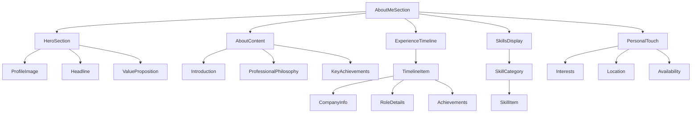

# About Me Component Design

## Component Overview

The About Me component serves as the primary landing section, introducing the developer and establishing credibility with potential employers and clients.

## Component Architecture

### Component Hierarchy


### Component Structure
```typescript
interface AboutMeSectionProps {
  profileData: ProfileData;
  experienceData: ExperienceData[];
  skillsData: SkillsData;
  personalData: PersonalData;
}

interface ProfileData {
  name: string;
  title: string;
  headline: string;
  valueProposition: string;
  profileImage: {
    src: string;
    alt: string;
    width: number;
    height: number;
  };
}

interface ExperienceData {
  id: string;
  company: string;
  role: string;
  duration: {
    start: string;
    end?: string;
    current?: boolean;
  };
  description: string;
  achievements: string[];
  technologies: string[];
  logo?: string;
}

interface SkillsData {
  categories: {
    [category: string]: SkillItem[];
  };
}

interface SkillItem {
  name: string;
  level: 'beginner' | 'intermediate' | 'advanced' | 'expert';
  yearsExperience?: number;
  icon?: string;
}

interface PersonalData {
  interests: string[];
  location: string;
  timezone: string;
  availability: 'available' | 'busy' | 'unavailable';
  bio: string;
}
```

## Design Specifications

### Layout Design

#### Desktop Layout (1024px+)
```css
.about-me-section {
  display: grid;
  grid-template-columns: 1fr 2fr;
  gap: 4rem;
  padding: 6rem 2rem;
  max-width: 1200px;
  margin: 0 auto;
}

.hero-section {
  display: flex;
  flex-direction: column;
  align-items: center;
  text-align: center;
}

.profile-image {
  width: 200px;
  height: 200px;
  border-radius: 50%;
  object-fit: cover;
  margin-bottom: 2rem;
  border: 4px solid var(--primary);
}

.content-section {
  display: flex;
  flex-direction: column;
  gap: 3rem;
}
```

#### Tablet Layout (768px - 1023px)
```css
.about-me-section {
  grid-template-columns: 1fr;
  gap: 3rem;
  padding: 4rem 2rem;
}

.hero-section {
  order: 1;
}

.content-section {
  order: 2;
}
```

#### Mobile Layout (< 768px)
```css
.about-me-section {
  padding: 3rem 1rem;
  gap: 2rem;
}

.profile-image {
  width: 150px;
  height: 150px;
}
```

### Typography Hierarchy

```css
.headline {
  font-size: var(--text-4xl);
  font-weight: 700;
  color: var(--text-primary);
  margin-bottom: 1rem;
  line-height: 1.2;
}

.value-proposition {
  font-size: var(--text-lg);
  color: var(--text-secondary);
  margin-bottom: 2rem;
  line-height: 1.6;
}

.section-title {
  font-size: var(--text-2xl);
  font-weight: 600;
  color: var(--text-primary);
  margin-bottom: 1.5rem;
  position: relative;
}

.section-title::after {
  content: '';
  position: absolute;
  bottom: -0.5rem;
  left: 0;
  width: 3rem;
  height: 2px;
  background: var(--primary);
}
```

### Experience Timeline Design

#### Timeline Layout
```css
.experience-timeline {
  position: relative;
  padding-left: 2rem;
}

.experience-timeline::before {
  content: '';
  position: absolute;
  left: 0;
  top: 0;
  bottom: 0;
  width: 2px;
  background: var(--border);
}

.timeline-item {
  position: relative;
  margin-bottom: 3rem;
  padding-left: 2rem;
}

.timeline-item::before {
  content: '';
  position: absolute;
  left: -1.5rem;
  top: 0.5rem;
  width: 12px;
  height: 12px;
  border-radius: 50%;
  background: var(--primary);
  border: 3px solid var(--background);
}

.timeline-content {
  background: var(--surface);
  padding: 1.5rem;
  border-radius: 0.5rem;
  border: 1px solid var(--border);
  transition: all 0.3s ease;
}

.timeline-content:hover {
  transform: translateY(-2px);
  box-shadow: 0 4px 12px rgba(0, 0, 0, 0.1);
}
```

### Skills Display Design

#### Skills Grid Layout
```css
.skills-grid {
  display: grid;
  grid-template-columns: repeat(auto-fit, minmax(200px, 1fr));
  gap: 1.5rem;
  margin-top: 2rem;
}

.skill-category {
  background: var(--surface);
  padding: 1.5rem;
  border-radius: 0.5rem;
  border: 1px solid var(--border);
}

.skill-category-title {
  font-size: var(--text-lg);
  font-weight: 600;
  color: var(--text-primary);
  margin-bottom: 1rem;
  display: flex;
  align-items: center;
  gap: 0.5rem;
}

.skill-item {
  display: flex;
  justify-content: space-between;
  align-items: center;
  padding: 0.5rem 0;
  border-bottom: 1px solid var(--border);
}

.skill-item:last-child {
  border-bottom: none;
}

.skill-name {
  font-size: var(--text-sm);
  color: var(--text-primary);
}

.skill-level {
  font-size: var(--text-xs);
  color: var(--text-secondary);
  text-transform: uppercase;
  letter-spacing: 0.05em;
}
```

## Interactive Elements

### Hover Effects
```css
.timeline-content:hover {
  transform: translateY(-2px);
  box-shadow: 0 4px 12px rgba(0, 0, 0, 0.1);
}

.skill-category:hover {
  transform: translateY(-1px);
  box-shadow: 0 2px 8px rgba(0, 0, 0, 0.1);
}
```

### Animation States
```css
@keyframes fadeInUp {
  from {
    opacity: 0;
    transform: translateY(20px);
  }
  to {
    opacity: 1;
    transform: translateY(0);
  }
}

.timeline-item {
  animation: fadeInUp 0.6s ease-out;
  animation-fill-mode: both;
}

.timeline-item:nth-child(1) { animation-delay: 0.1s; }
.timeline-item:nth-child(2) { animation-delay: 0.2s; }
.timeline-item:nth-child(3) { animation-delay: 0.3s; }
```

## Responsive Behavior

### Breakpoint Strategy
- **Mobile First**: Design starts with mobile layout
- **Progressive Enhancement**: Add complexity for larger screens
- **Touch Optimization**: Ensure touch targets are minimum 44px

### Content Adaptation
- **Image Optimization**: Responsive images with different sizes
- **Text Scaling**: Appropriate font sizes for each breakpoint
- **Spacing Adjustment**: Consistent spacing across devices

## Accessibility Features

### Semantic HTML Structure
```html
<section id="about" aria-labelledby="about-heading">
  <h2 id="about-heading" class="visually-hidden">About Me</h2>
  
  <div class="hero-section">
    
    <h1 class="headline">[Name]</h1>
    <p class="value-proposition">[Value Proposition]</p>
  </div>
  
  <div class="content-section">
    <article class="about-content">
      <h3 class="section-title">About</h3>
      <p>[Introduction content]</p>
    </article>
    
    <section class="experience-timeline" aria-labelledby="experience-heading">
      <h3 id="experience-heading" class="section-title">Experience</h3>
      <div class="timeline-item">
        <div class="timeline-content">
          <h4>[Role Title]</h4>
          <p>[Company Name]</p>
          <time datetime="[ISO Date]">[Duration]</time>
        </div>
      </div>
    </section>
  </div>
</section>
```

### ARIA Labels and Roles
- **Landmark Roles**: Use `<section>`, `<article>`, `<nav>`
- **Heading Hierarchy**: Proper h1-h6 structure
- **Time Elements**: Use `<time>` for dates and durations
- **Alt Text**: Descriptive alt text for profile image

### Keyboard Navigation
- **Tab Order**: Logical tab sequence through content
- **Focus Indicators**: Clear focus states for interactive elements
- **Skip Links**: Skip to main content functionality

## Performance Considerations

### Image Optimization
```typescript
// Next.js Image component usage
import Image from 'next/image';

<Image
  src="/images/profile.jpg"
  alt="Professional headshot"
  width={200}
  height={200}
  priority={true} // Load immediately for above-the-fold content
  className="profile-image"
/>
```

### Lazy Loading Strategy
- **Above-the-fold**: Profile image loads immediately
- **Below-the-fold**: Timeline and skills load on scroll
- **Progressive Enhancement**: Content loads in stages

### Code Splitting
```typescript
// Dynamic imports for heavy components
const ExperienceTimeline = dynamic(() => import('./ExperienceTimeline'), {
  loading: () => <TimelineSkeleton />,
});

const SkillsDisplay = dynamic(() => import('./SkillsDisplay'), {
  loading: () => <SkillsSkeleton />,
});
```

## Content Management

### Data Structure
```json
{
  "profile": {
    "name": "John Doe",
    "title": "Full-Stack Developer",
    "headline": "Building digital experiences that matter",
    "valueProposition": "Passionate developer with 5+ years of experience creating scalable web applications.",
    "profileImage": {
      "src": "/images/profile.jpg",
      "alt": "Professional headshot of John Doe",
      "width": 400,
      "height": 400
    }
  },
  "experience": [
    {
      "id": "exp-1",
      "company": "Tech Corp",
      "role": "Senior Frontend Developer",
      "duration": {
        "start": "2022-01",
        "current": true
      },
      "description": "Lead frontend development for customer-facing applications",
      "achievements": [
        "Improved page load times by 40%",
        "Led team of 3 developers",
        "Implemented design system"
      ],
      "technologies": ["React", "TypeScript", "Next.js"]
    }
  ],
  "skills": {
    "categories": {
      "Frontend": [
        { "name": "React", "level": "expert", "yearsExperience": 4 },
        { "name": "TypeScript", "level": "advanced", "yearsExperience": 3 }
      ],
      "Backend": [
        { "name": "Node.js", "level": "advanced", "yearsExperience": 3 },
        { "name": "Python", "level": "intermediate", "yearsExperience": 2 }
      ]
    }
  },
  "personal": {
    "interests": ["Photography", "Hiking", "Open Source"],
    "location": "San Francisco, CA",
    "timezone": "PST",
    "availability": "available",
    "bio": "Passionate about technology and continuous learning..."
  }
}
```

## Testing Strategy

### Unit Tests
- Component rendering with different props
- Data validation and error handling
- Responsive behavior testing

### Integration Tests
- Data flow from props to rendered content
- Interaction with parent components
- Accessibility compliance testing

### Visual Regression Tests
- Layout consistency across breakpoints
- Theme switching behavior
- Animation and transition testing

## Implementation Checklist

### Development Phase
- [ ] Create component structure and interfaces
- [ ] Implement responsive layout system
- [ ] Add animation and interaction effects
- [ ] Implement accessibility features
- [ ] Add performance optimizations

### Testing Phase
- [ ] Unit tests for all components
- [ ] Integration tests for data flow
- [ ] Accessibility testing with screen readers
- [ ] Cross-browser compatibility testing
- [ ] Performance testing and optimization

### Content Phase
- [ ] Prepare profile image and content
- [ ] Write compelling copy and descriptions
- [ ] Gather experience and skills data
- [ ] Review and proofread all content
- [ ] Optimize images for web performance
