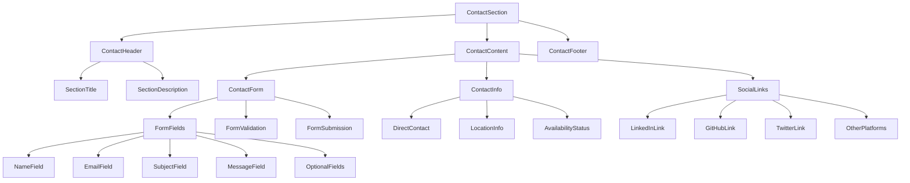

# Contact Form Component Design

## Component Overview

The Contact component provides multiple ways for potential employers and clients to get in touch, featuring a functional contact form with validation, alternative contact methods, and social media integration.

## Component Architecture

### Component Hierarchy


### Component Structure
```typescript
interface ContactSectionProps {
  contactInfo: ContactInfo;
  socialLinks: SocialLink[];
  formConfig: FormConfig;
}

interface ContactInfo {
  email: string;
  phone?: string;
  location: string;
  timezone: string;
  availability: 'available' | 'busy' | 'unavailable';
  responseTime: string;
}

interface SocialLink {
  platform: string;
  url: string;
  icon: string;
  label: string;
  description?: string;
}

interface FormConfig {
  endpoint: string;
  fields: FormField[];
  validation: ValidationRules;
  messages: FormMessages;
}

interface FormField {
  name: string;
  type: 'text' | 'email' | 'tel' | 'textarea' | 'select';
  label: string;
  placeholder?: string;
  required: boolean;
  validation?: FieldValidation;
}

interface FormData {
  name: string;
  email: string;
  subject: string;
  message: string;
  phone?: string;
  company?: string;
}

interface FormState {
  data: FormData;
  errors: FormErrors;
  isSubmitting: boolean;
  isSubmitted: boolean;
  submitError?: string;
}

interface FormErrors {
  [key: string]: string;
}
```

## Design Specifications

### Layout Design

#### Desktop Layout (1024px+)
```css
.contact-section {
  padding: 6rem 2rem;
  max-width: 1200px;
  margin: 0 auto;
}

.contact-content {
  display: grid;
  grid-template-columns: 1fr 1fr;
  gap: 4rem;
  margin-top: 3rem;
}

.contact-form-container {
  background: var(--surface);
  padding: 2rem;
  border-radius: 1rem;
  border: 1px solid var(--border);
}

.contact-info-container {
  display: flex;
  flex-direction: column;
  gap: 2rem;
}
```

#### Tablet Layout (768px - 1023px)
```css
.contact-content {
  grid-template-columns: 1fr;
  gap: 3rem;
}

.contact-form-container {
  order: 1;
}

.contact-info-container {
  order: 2;
}
```

#### Mobile Layout (< 768px)
```css
.contact-section {
  padding: 4rem 1rem;
}

.contact-form-container {
  padding: 1.5rem;
}

.contact-info-container {
  gap: 1.5rem;
}
```

### Contact Form Design

#### Form Layout
```css
.contact-form {
  display: flex;
  flex-direction: column;
  gap: 1.5rem;
}

.form-group {
  display: flex;
  flex-direction: column;
  gap: 0.5rem;
}

.form-row {
  display: grid;
  grid-template-columns: 1fr 1fr;
  gap: 1rem;
}

.form-label {
  font-size: var(--text-sm);
  font-weight: 600;
  color: var(--text-primary);
  margin-bottom: 0.25rem;
}

.form-label.required::after {
  content: ' *';
  color: var(--error);
}

.form-input {
  padding: 0.75rem 1rem;
  border: 2px solid var(--border);
  border-radius: 0.5rem;
  font-size: var(--text-base);
  background: var(--background);
  color: var(--text-primary);
  transition: all 0.2s ease;
  min-height: 44px;
}

.form-input:focus {
  outline: none;
  border-color: var(--primary);
  box-shadow: 0 0 0 3px rgba(59, 130, 246, 0.1);
}

.form-input.error {
  border-color: var(--error);
  box-shadow: 0 0 0 3px rgba(239, 68, 68, 0.1);
}

.form-input.success {
  border-color: var(--success);
  box-shadow: 0 0 0 3px rgba(16, 185, 129, 0.1);
}

.form-textarea {
  min-height: 120px;
  resize: vertical;
  font-family: inherit;
}

.form-error {
  font-size: var(--text-xs);
  color: var(--error);
  margin-top: 0.25rem;
  display: flex;
  align-items: center;
  gap: 0.25rem;
}

.form-success {
  font-size: var(--text-xs);
  color: var(--success);
  margin-top: 0.25rem;
  display: flex;
  align-items: center;
  gap: 0.25rem;
}
```

#### Submit Button Design
```css
.form-submit {
  padding: 1rem 2rem;
  background: var(--primary);
  color: white;
  border: none;
  border-radius: 0.5rem;
  font-size: var(--text-base);
  font-weight: 600;
  cursor: pointer;
  transition: all 0.2s ease;
  min-height: 48px;
  display: flex;
  align-items: center;
  justify-content: center;
  gap: 0.5rem;
}

.form-submit:hover:not(:disabled) {
  background: var(--primary-dark);
  transform: translateY(-1px);
}

.form-submit:disabled {
  background: var(--secondary);
  cursor: not-allowed;
  opacity: 0.6;
}

.form-submit.loading {
  background: var(--secondary);
}

.submit-spinner {
  width: 1rem;
  height: 1rem;
  border: 2px solid transparent;
  border-top: 2px solid currentColor;
  border-radius: 50%;
  animation: spin 1s linear infinite;
}

@keyframes spin {
  to {
    transform: rotate(360deg);
  }
}
```

### Contact Information Design

#### Contact Info Cards
```css
.contact-info-card {
  background: var(--surface);
  padding: 1.5rem;
  border-radius: 0.75rem;
  border: 1px solid var(--border);
  transition: all 0.2s ease;
}

.contact-info-card:hover {
  transform: translateY(-2px);
  box-shadow: 0 4px 12px rgba(0, 0, 0, 0.1);
}

.contact-info-header {
  display: flex;
  align-items: center;
  gap: 0.75rem;
  margin-bottom: 1rem;
}

.contact-info-icon {
  width: 1.5rem;
  height: 1.5rem;
  color: var(--primary);
}

.contact-info-title {
  font-size: var(--text-lg);
  font-weight: 600;
  color: var(--text-primary);
}

.contact-info-content {
  font-size: var(--text-sm);
  color: var(--text-secondary);
  line-height: 1.5;
}

.contact-link {
  color: var(--primary);
  text-decoration: none;
  transition: color 0.2s ease;
}

.contact-link:hover {
  color: var(--primary-dark);
  text-decoration: underline;
}

.availability-status {
  display: inline-flex;
  align-items: center;
  gap: 0.5rem;
  padding: 0.25rem 0.75rem;
  border-radius: 1rem;
  font-size: var(--text-xs);
  font-weight: 500;
  margin-top: 0.5rem;
}

.availability-status.available {
  background: rgba(16, 185, 129, 0.1);
  color: var(--success);
}

.availability-status.busy {
  background: rgba(245, 158, 11, 0.1);
  color: var(--warning);
}

.availability-status.unavailable {
  background: rgba(239, 68, 68, 0.1);
  color: var(--error);
}

.status-dot {
  width: 0.5rem;
  height: 0.5rem;
  border-radius: 50%;
  background: currentColor;
}
```

### Social Links Design

#### Social Links Grid
```css
.social-links {
  display: grid;
  grid-template-columns: repeat(auto-fit, minmax(200px, 1fr));
  gap: 1rem;
  margin-top: 2rem;
}

.social-link {
  display: flex;
  align-items: center;
  gap: 0.75rem;
  padding: 1rem;
  background: var(--surface);
  border: 1px solid var(--border);
  border-radius: 0.5rem;
  text-decoration: none;
  color: var(--text-primary);
  transition: all 0.2s ease;
}

.social-link:hover {
  transform: translateY(-2px);
  box-shadow: 0 4px 12px rgba(0, 0, 0, 0.1);
  border-color: var(--primary);
}

.social-link-icon {
  width: 1.5rem;
  height: 1.5rem;
  color: var(--primary);
}

.social-link-content {
  flex: 1;
}

.social-link-label {
  font-size: var(--text-sm);
  font-weight: 600;
  color: var(--text-primary);
  margin-bottom: 0.25rem;
}

.social-link-description {
  font-size: var(--text-xs);
  color: var(--text-secondary);
}
```

## Interactive Elements

### Form Validation States
```css
.form-input.validating {
  border-color: var(--warning);
  box-shadow: 0 0 0 3px rgba(245, 158, 11, 0.1);
}

.form-input.valid {
  border-color: var(--success);
  box-shadow: 0 0 0 3px rgba(16, 185, 129, 0.1);
}

.form-input.invalid {
  border-color: var(--error);
  box-shadow: 0 0 0 3px rgba(239, 68, 68, 0.1);
}
```

### Animation States
```css
@keyframes slideInUp {
  from {
    opacity: 0;
    transform: translateY(20px);
  }
  to {
    opacity: 1;
    transform: translateY(0);
  }
}

.contact-form-container {
  animation: slideInUp 0.6s ease-out;
}

.contact-info-card {
  animation: slideInUp 0.6s ease-out;
  animation-fill-mode: both;
}

.contact-info-card:nth-child(1) { animation-delay: 0.1s; }
.contact-info-card:nth-child(2) { animation-delay: 0.2s; }
.contact-info-card:nth-child(3) { animation-delay: 0.3s; }
```

### Success/Error Messages
```css
.form-message {
  padding: 1rem;
  border-radius: 0.5rem;
  margin-bottom: 1rem;
  display: flex;
  align-items: center;
  gap: 0.75rem;
  font-size: var(--text-sm);
}

.form-message.success {
  background: rgba(16, 185, 129, 0.1);
  color: var(--success);
  border: 1px solid rgba(16, 185, 129, 0.2);
}

.form-message.error {
  background: rgba(239, 68, 68, 0.1);
  color: var(--error);
  border: 1px solid rgba(239, 68, 68, 0.2);
}

.form-message-icon {
  width: 1.25rem;
  height: 1.25rem;
  flex-shrink: 0;
}
```

## Responsive Behavior

### Mobile Form Optimization
```css
@media (max-width: 768px) {
  .form-row {
    grid-template-columns: 1fr;
    gap: 0;
  }
  
  .contact-form-container {
    padding: 1rem;
  }
  
  .form-input {
    font-size: 16px; /* Prevent zoom on iOS */
  }
  
  .social-links {
    grid-template-columns: 1fr;
  }
}
```

### Touch Optimization
```css
.form-input {
  min-height: 44px;
  touch-action: manipulation;
}

.form-submit {
  min-height: 48px;
  touch-action: manipulation;
}

.social-link {
  min-height: 44px;
  touch-action: manipulation;
}
```

## Accessibility Features

### Semantic HTML Structure
```html
<section id="contact" aria-labelledby="contact-heading">
  <h2 id="contact-heading" class="section-title">Get In Touch</h2>
  <p class="section-description">I'm always interested in new opportunities and exciting projects.</p>
  
  <div class="contact-content">
    <div class="contact-form-container">
      <form class="contact-form" novalidate aria-label="Contact form">
        <div class="form-group">
          <label for="name" class="form-label required">Name</label>
          <input
            type="text"
            id="name"
            name="name"
            class="form-input"
            required
            aria-describedby="name-error"
            aria-invalid="false"
          />
          <div id="name-error" class="form-error" role="alert" aria-live="polite"></div>
        </div>
        
        <div class="form-group">
          <label for="email" class="form-label required">Email</label>
          <input
            type="email"
            id="email"
            name="email"
            class="form-input"
            required
            aria-describedby="email-error"
            aria-invalid="false"
          />
          <div id="email-error" class="form-error" role="alert" aria-live="polite"></div>
        </div>
        
        <div class="form-group">
          <label for="subject" class="form-label required">Subject</label>
          <input
            type="text"
            id="subject"
            name="subject"
            class="form-input"
            required
            aria-describedby="subject-error"
            aria-invalid="false"
          />
          <div id="subject-error" class="form-error" role="alert" aria-live="polite"></div>
        </div>
        
        <div class="form-group">
          <label for="message" class="form-label required">Message</label>
          <textarea
            id="message"
            name="message"
            class="form-input form-textarea"
            required
            aria-describedby="message-error"
            aria-invalid="false"
          ></textarea>
          <div id="message-error" class="form-error" role="alert" aria-live="polite"></div>
        </div>
        
        <button type="submit" class="form-submit" aria-describedby="submit-status">
          Send Message
        </button>
        <div id="submit-status" class="form-message" role="status" aria-live="polite"></div>
      </form>
    </div>
    
    <div class="contact-info-container">
      <div class="contact-info-card">
        <div class="contact-info-header">
          <svg class="contact-info-icon" aria-hidden="true">
            <use href="#email-icon"></use>
          </svg>
          <h3 class="contact-info-title">Email</h3>
        </div>
        <div class="contact-info-content">
          <a href="mailto:contact@example.com" class="contact-link">
            contact@example.com
          </a>
          <p>I typically respond within 24 hours</p>
        </div>
      </div>
      
      <div class="contact-info-card">
        <div class="contact-info-header">
          <svg class="contact-info-icon" aria-hidden="true">
            <use href="#location-icon"></use>
          </svg>
          <h3 class="contact-info-title">Location</h3>
        </div>
        <div class="contact-info-content">
          <p>San Francisco, CA</p>
          <p>Pacific Time (PT)</p>
        </div>
      </div>
      
      <div class="contact-info-card">
        <div class="contact-info-header">
          <svg class="contact-info-icon" aria-hidden="true">
            <use href="#availability-icon"></use>
          </svg>
          <h3 class="contact-info-title">Availability</h3>
        </div>
        <div class="contact-info-content">
          <div class="availability-status available">
            <span class="status-dot" aria-hidden="true"></span>
            Available for new projects
          </div>
        </div>
      </div>
    </div>
  </div>
  
  <div class="social-links">
    <a href="https://linkedin.com/in/username" class="social-link" target="_blank" rel="noopener noreferrer">
      <svg class="social-link-icon" aria-hidden="true">
        <use href="#linkedin-icon"></use>
      </svg>
      <div class="social-link-content">
        <div class="social-link-label">LinkedIn</div>
        <div class="social-link-description">Professional network</div>
      </div>
    </a>
  </div>
</section>
```

### ARIA Labels and Roles
- **Form Labels**: Proper label association with form controls
- **Error Messages**: Use `role="alert"` and `aria-live="polite"`
- **Status Messages**: Use `role="status"` for success messages
- **Required Fields**: Use `aria-required="true"` and visual indicators

### Keyboard Navigation
- **Tab Order**: Logical tab sequence through form fields
- **Enter Key**: Submit form when focus is on submit button
- **Escape Key**: Clear form or close any error messages
- **Arrow Keys**: Navigate between radio buttons or options

## Performance Considerations

### Form Submission Optimization
```typescript
// Debounced validation
const debouncedValidation = useCallback(
  debounce((field: string, value: string) => {
    validateField(field, value);
  }, 300),
  []
);

// Form submission with loading states
const handleSubmit = async (e: React.FormEvent) => {
  e.preventDefault();
  
  setIsSubmitting(true);
  setSubmitError(null);
  
  try {
    const response = await fetch(formConfig.endpoint, {
      method: 'POST',
      headers: {
        'Content-Type': 'application/json',
      },
      body: JSON.stringify(formData),
    });
    
    if (response.ok) {
      setIsSubmitted(true);
      resetForm();
    } else {
      throw new Error('Submission failed');
    }
  } catch (error) {
    setSubmitError('Failed to send message. Please try again.');
  } finally {
    setIsSubmitting(false);
  }
};
```

### Validation Strategy
- **Client-side**: Real-time validation for better UX
- **Server-side**: Backup validation for security
- **Debounced**: Prevent excessive validation calls
- **Progressive**: Validate fields as user types

## Content Management

### Form Configuration
```json
{
  "formConfig": {
    "endpoint": "https://formspree.io/f/your-form-id",
    "fields": [
      {
        "name": "name",
        "type": "text",
        "label": "Name",
        "placeholder": "Your full name",
        "required": true,
        "validation": {
          "minLength": 2,
          "maxLength": 50,
          "pattern": "^[a-zA-Z\\s]+$"
        }
      },
      {
        "name": "email",
        "type": "email",
        "label": "Email",
        "placeholder": "your.email@example.com",
        "required": true,
        "validation": {
          "pattern": "^[^@]+@[^@]+\\.[^@]+$"
        }
      },
      {
        "name": "subject",
        "type": "text",
        "label": "Subject",
        "placeholder": "What's this about?",
        "required": true,
        "validation": {
          "minLength": 5,
          "maxLength": 100
        }
      },
      {
        "name": "message",
        "type": "textarea",
        "label": "Message",
        "placeholder": "Tell me about your project or opportunity...",
        "required": true,
        "validation": {
          "minLength": 10,
          "maxLength": 1000
        }
      },
      {
        "name": "phone",
        "type": "tel",
        "label": "Phone",
        "placeholder": "+1 (555) 123-4567",
        "required": false,
        "validation": {
          "pattern": "^[\\+]?[1-9][\\d\\s\\-\\(\\)]{7,}$"
        }
      },
      {
        "name": "company",
        "type": "text",
        "label": "Company",
        "placeholder": "Your company name",
        "required": false,
        "validation": {
          "maxLength": 100
        }
      }
    ],
    "messages": {
      "success": "Thank you! Your message has been sent successfully.",
      "error": "Sorry, there was an error sending your message. Please try again.",
      "validation": {
        "required": "This field is required",
        "email": "Please enter a valid email address",
        "minLength": "Must be at least {min} characters",
        "maxLength": "Must be no more than {max} characters",
        "pattern": "Please enter a valid {field}"
      }
    }
  },
  "contactInfo": {
    "email": "contact@example.com",
    "phone": "+1 (555) 123-4567",
    "location": "San Francisco, CA",
    "timezone": "Pacific Time (PT)",
    "availability": "available",
    "responseTime": "I typically respond within 24 hours"
  },
  "socialLinks": [
    {
      "platform": "linkedin",
      "url": "https://linkedin.com/in/username",
      "icon": "linkedin",
      "label": "LinkedIn",
      "description": "Professional network"
    },
    {
      "platform": "github",
      "url": "https://github.com/username",
      "icon": "github",
      "label": "GitHub",
      "description": "Code repositories"
    },
    {
      "platform": "twitter",
      "url": "https://twitter.com/username",
      "icon": "twitter",
      "label": "Twitter",
      "description": "Tech community"
    }
  ]
}
```

## Testing Strategy

### Unit Tests
- Form validation logic
- Form submission handling
- Error message display
- Success state management

### Integration Tests
- Form submission to Formspree
- Contact info display
- Social links functionality
- Accessibility compliance

### Visual Regression Tests
- Form layout across breakpoints
- Validation state appearance
- Success/error message styling
- Contact info card layouts

## Implementation Checklist

### Development Phase
- [ ] Create contact form component with validation
- [ ] Implement Formspree integration
- [ ] Build contact info cards
- [ ] Add social links section
- [ ] Implement responsive design

### Testing Phase
- [ ] Unit tests for form validation
- [ ] Integration tests for form submission
- [ ] Accessibility testing with screen readers
- [ ] Cross-browser compatibility testing
- [ ] Mobile form testing

### Content Phase
- [ ] Set up Formspree account and endpoint
- [ ] Prepare contact information
- [ ] Update social media profiles
- [ ] Write form labels and messages
- [ ] Test form submission process
