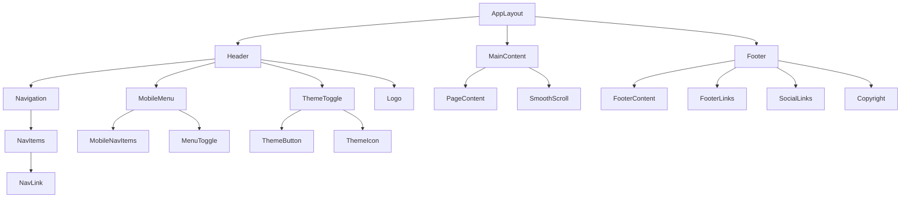

# Navigation & Layout Component Design

## Component Overview

The Navigation and Layout system provides intuitive wayfinding and ensures consistent user experience across all sections of the portfolio website, including responsive navigation, smooth scrolling, and theme switching.

## Component Architecture

### Component Hierarchy


### Component Structure
```typescript
interface AppLayoutProps {
  children: React.ReactNode;
  currentSection?: string;
}

interface HeaderProps {
  isScrolled: boolean;
  isMobileMenuOpen: boolean;
  onMobileMenuToggle: () => void;
  onThemeToggle: () => void;
  currentTheme: 'light' | 'dark';
}

interface NavigationProps {
  items: NavigationItem[];
  currentSection: string;
  onNavClick: (section: string) => void;
  isMobile?: boolean;
}

interface NavigationItem {
  id: string;
  label: string;
  href: string;
  icon?: string;
  external?: boolean;
  order: number;
}

interface FooterProps {
  contactInfo: ContactInfo;
  socialLinks: SocialLink[];
  quickLinks: NavigationItem[];
}

interface ThemeToggleProps {
  currentTheme: 'light' | 'dark';
  onToggle: () => void;
}

interface MobileMenuProps {
  isOpen: boolean;
  onClose: () => void;
  navigationItems: NavigationItem[];
  onNavClick: (section: string) => void;
}
```

## Design Specifications

### Header Design

#### Desktop Header Layout
```css
.header {
  position: fixed;
  top: 0;
  left: 0;
  right: 0;
  z-index: 1000;
  background: rgba(255, 255, 255, 0.95);
  backdrop-filter: blur(10px);
  border-bottom: 1px solid var(--border);
  transition: all 0.3s ease;
}

.header.scrolled {
  background: rgba(255, 255, 255, 0.98);
  box-shadow: 0 2px 20px rgba(0, 0, 0, 0.1);
}

.header-content {
  max-width: 1200px;
  margin: 0 auto;
  padding: 0 2rem;
  display: flex;
  align-items: center;
  justify-content: space-between;
  height: 4rem;
}

.logo {
  font-size: var(--text-xl);
  font-weight: 700;
  color: var(--text-primary);
  text-decoration: none;
  transition: color 0.2s ease;
}

.logo:hover {
  color: var(--primary);
}

.navigation {
  display: flex;
  align-items: center;
  gap: 2rem;
}

.nav-items {
  display: flex;
  align-items: center;
  gap: 1.5rem;
}

.nav-link {
  font-size: var(--text-sm);
  font-weight: 500;
  color: var(--text-secondary);
  text-decoration: none;
  padding: 0.5rem 1rem;
  border-radius: 0.5rem;
  transition: all 0.2s ease;
  position: relative;
}

.nav-link:hover {
  color: var(--text-primary);
  background: var(--surface);
}

.nav-link.active {
  color: var(--primary);
  background: rgba(59, 130, 246, 0.1);
}

.nav-link.active::after {
  content: '';
  position: absolute;
  bottom: -0.5rem;
  left: 50%;
  transform: translateX(-50%);
  width: 0.5rem;
  height: 0.5rem;
  background: var(--primary);
  border-radius: 50%;
}

.header-actions {
  display: flex;
  align-items: center;
  gap: 1rem;
}
```

#### Mobile Header Layout
```css
@media (max-width: 768px) {
  .header-content {
    padding: 0 1rem;
  }
  
  .navigation {
    display: none;
  }
  
  .header-actions {
    gap: 0.5rem;
  }
  
  .logo {
    font-size: var(--text-lg);
  }
}

.mobile-menu-toggle {
  display: none;
  background: none;
  border: none;
  cursor: pointer;
  padding: 0.5rem;
  border-radius: 0.25rem;
  transition: background 0.2s ease;
}

.mobile-menu-toggle:hover {
  background: var(--surface);
}

@media (max-width: 768px) {
  .mobile-menu-toggle {
    display: flex;
    align-items: center;
    justify-content: center;
  }
}

.hamburger {
  width: 1.5rem;
  height: 1.5rem;
  display: flex;
  flex-direction: column;
  justify-content: space-around;
}

.hamburger-line {
  width: 100%;
  height: 2px;
  background: var(--text-primary);
  transition: all 0.3s ease;
  transform-origin: center;
}

.hamburger.active .hamburger-line:nth-child(1) {
  transform: rotate(45deg) translate(5px, 5px);
}

.hamburger.active .hamburger-line:nth-child(2) {
  opacity: 0;
}

.hamburger.active .hamburger-line:nth-child(3) {
  transform: rotate(-45deg) translate(7px, -6px);
}
```

### Mobile Menu Design

#### Mobile Menu Layout
```css
.mobile-menu {
  position: fixed;
  top: 4rem;
  left: 0;
  right: 0;
  bottom: 0;
  background: var(--background);
  transform: translateX(-100%);
  transition: transform 0.3s ease;
  z-index: 999;
  overflow-y: auto;
}

.mobile-menu.open {
  transform: translateX(0);
}

.mobile-menu-content {
  padding: 2rem 1rem;
}

.mobile-nav-items {
  display: flex;
  flex-direction: column;
  gap: 0.5rem;
}

.mobile-nav-link {
  display: flex;
  align-items: center;
  gap: 1rem;
  padding: 1rem;
  font-size: var(--text-lg);
  font-weight: 500;
  color: var(--text-primary);
  text-decoration: none;
  border-radius: 0.5rem;
  transition: all 0.2s ease;
  border: 1px solid transparent;
}

.mobile-nav-link:hover {
  background: var(--surface);
  border-color: var(--border);
}

.mobile-nav-link.active {
  background: rgba(59, 130, 246, 0.1);
  border-color: var(--primary);
  color: var(--primary);
}

.mobile-nav-icon {
  width: 1.25rem;
  height: 1.25rem;
  color: var(--text-secondary);
}

.mobile-nav-link.active .mobile-nav-icon {
  color: var(--primary);
}

.mobile-menu-overlay {
  position: fixed;
  top: 0;
  left: 0;
  right: 0;
  bottom: 0;
  background: rgba(0, 0, 0, 0.5);
  opacity: 0;
  visibility: hidden;
  transition: all 0.3s ease;
  z-index: 998;
}

.mobile-menu-overlay.open {
  opacity: 1;
  visibility: visible;
}
```

### Theme Toggle Design

#### Theme Toggle Layout
```css
.theme-toggle {
  position: relative;
  width: 3rem;
  height: 1.5rem;
  background: var(--border);
  border-radius: 1rem;
  cursor: pointer;
  transition: all 0.3s ease;
  border: none;
  padding: 0;
}

.theme-toggle:hover {
  background: var(--secondary);
}

.theme-toggle.active {
  background: var(--primary);
}

.theme-toggle-slider {
  position: absolute;
  top: 0.125rem;
  left: 0.125rem;
  width: 1.25rem;
  height: 1.25rem;
  background: white;
  border-radius: 50%;
  transition: all 0.3s ease;
  display: flex;
  align-items: center;
  justify-content: center;
  box-shadow: 0 2px 4px rgba(0, 0, 0, 0.2);
}

.theme-toggle.active .theme-toggle-slider {
  transform: translateX(1.5rem);
}

.theme-icon {
  width: 0.75rem;
  height: 0.75rem;
  color: var(--text-secondary);
  transition: color 0.3s ease;
}

.theme-toggle.active .theme-icon {
  color: var(--primary);
}

/* Alternative button-style theme toggle */
.theme-toggle-button {
  background: none;
  border: 2px solid var(--border);
  border-radius: 0.5rem;
  padding: 0.5rem;
  cursor: pointer;
  transition: all 0.2s ease;
  display: flex;
  align-items: center;
  justify-content: center;
}

.theme-toggle-button:hover {
  border-color: var(--primary);
  background: var(--surface);
}

.theme-toggle-icon {
  width: 1.25rem;
  height: 1.25rem;
  color: var(--text-secondary);
  transition: color 0.2s ease;
}

.theme-toggle-button:hover .theme-toggle-icon {
  color: var(--primary);
}
```

### Footer Design

#### Footer Layout
```css
.footer {
  background: var(--surface);
  border-top: 1px solid var(--border);
  padding: 3rem 0 1rem;
  margin-top: 6rem;
}

.footer-content {
  max-width: 1200px;
  margin: 0 auto;
  padding: 0 2rem;
}

.footer-main {
  display: grid;
  grid-template-columns: 2fr 1fr 1fr;
  gap: 3rem;
  margin-bottom: 2rem;
}

.footer-brand {
  display: flex;
  flex-direction: column;
  gap: 1rem;
}

.footer-logo {
  font-size: var(--text-xl);
  font-weight: 700;
  color: var(--text-primary);
  text-decoration: none;
}

.footer-description {
  font-size: var(--text-sm);
  color: var(--text-secondary);
  line-height: 1.6;
  max-width: 300px;
}

.footer-section {
  display: flex;
  flex-direction: column;
  gap: 1rem;
}

.footer-section-title {
  font-size: var(--text-base);
  font-weight: 600;
  color: var(--text-primary);
  margin-bottom: 0.5rem;
}

.footer-links {
  display: flex;
  flex-direction: column;
  gap: 0.5rem;
}

.footer-link {
  font-size: var(--text-sm);
  color: var(--text-secondary);
  text-decoration: none;
  transition: color 0.2s ease;
}

.footer-link:hover {
  color: var(--primary);
}

.footer-social {
  display: flex;
  gap: 1rem;
  margin-top: 1rem;
}

.footer-social-link {
  display: flex;
  align-items: center;
  justify-content: center;
  width: 2.5rem;
  height: 2.5rem;
  background: var(--background);
  border: 1px solid var(--border);
  border-radius: 50%;
  color: var(--text-secondary);
  text-decoration: none;
  transition: all 0.2s ease;
}

.footer-social-link:hover {
  background: var(--primary);
  color: white;
  border-color: var(--primary);
  transform: translateY(-2px);
}

.footer-social-icon {
  width: 1.25rem;
  height: 1.25rem;
}

.footer-bottom {
  border-top: 1px solid var(--border);
  padding-top: 1.5rem;
  display: flex;
  justify-content: space-between;
  align-items: center;
  flex-wrap: wrap;
  gap: 1rem;
}

.footer-copyright {
  font-size: var(--text-sm);
  color: var(--text-secondary);
}

.footer-legal {
  display: flex;
  gap: 1.5rem;
}

.footer-legal-link {
  font-size: var(--text-sm);
  color: var(--text-secondary);
  text-decoration: none;
  transition: color 0.2s ease;
}

.footer-legal-link:hover {
  color: var(--primary);
}
```

#### Mobile Footer Layout
```css
@media (max-width: 768px) {
  .footer-main {
    grid-template-columns: 1fr;
    gap: 2rem;
  }
  
  .footer-bottom {
    flex-direction: column;
    text-align: center;
  }
  
  .footer-legal {
    justify-content: center;
  }
}
```

### Smooth Scrolling Implementation

#### Smooth Scroll Behavior
```css
html {
  scroll-behavior: smooth;
}

@media (prefers-reduced-motion: reduce) {
  html {
    scroll-behavior: auto;
  }
}

.section {
  scroll-margin-top: 5rem; /* Account for fixed header */
}

/* Custom scrollbar for webkit browsers */
::-webkit-scrollbar {
  width: 8px;
}

::-webkit-scrollbar-track {
  background: var(--surface);
}

::-webkit-scrollbar-thumb {
  background: var(--border);
  border-radius: 4px;
}

::-webkit-scrollbar-thumb:hover {
  background: var(--secondary);
}
```

## Interactive Elements

### Navigation Hover Effects
```css
.nav-link::before {
  content: '';
  position: absolute;
  bottom: 0;
  left: 50%;
  transform: translateX(-50%);
  width: 0;
  height: 2px;
  background: var(--primary);
  transition: width 0.3s ease;
}

.nav-link:hover::before {
  width: 80%;
}

.nav-link.active::before {
  width: 100%;
}
```

### Animation States
```css
@keyframes slideInDown {
  from {
    opacity: 0;
    transform: translateY(-20px);
  }
  to {
    opacity: 1;
    transform: translateY(0);
  }
}

.header {
  animation: slideInDown 0.6s ease-out;
}

@keyframes fadeInUp {
  from {
    opacity: 0;
    transform: translateY(20px);
  }
  to {
    opacity: 1;
    transform: translateY(0);
  }
}

.footer {
  animation: fadeInUp 0.6s ease-out;
}
```

### Loading States
```css
.nav-link.loading {
  opacity: 0.6;
  pointer-events: none;
}

.theme-toggle.loading {
  opacity: 0.6;
  pointer-events: none;
}

.mobile-menu-toggle.loading {
  opacity: 0.6;
  pointer-events: none;
}
```

## Responsive Behavior

### Breakpoint Strategy
```css
/* Mobile First Approach */
@media (min-width: 640px) {
  /* Small devices */
}

@media (min-width: 768px) {
  /* Medium devices - Show desktop navigation */
  .navigation {
    display: flex;
  }
  
  .mobile-menu-toggle {
    display: none;
  }
}

@media (min-width: 1024px) {
  /* Large devices */
  .header-content {
    padding: 0 3rem;
  }
}

@media (min-width: 1280px) {
  /* Extra large devices */
  .header-content {
    padding: 0 4rem;
  }
}
```

### Touch Optimization
```css
.nav-link {
  min-height: 44px;
  touch-action: manipulation;
}

.mobile-nav-link {
  min-height: 48px;
  touch-action: manipulation;
}

.theme-toggle {
  min-height: 44px;
  touch-action: manipulation;
}

.footer-social-link {
  min-height: 44px;
  touch-action: manipulation;
}
```

## Accessibility Features

### Semantic HTML Structure
```html
<header class="header" role="banner">
  <div class="header-content">
    <a href="#home" class="logo" aria-label="Portfolio Home">
      Your Name
    </a>
    
    <nav class="navigation" role="navigation" aria-label="Main navigation">
      <ul class="nav-items" role="menubar">
        <li role="none">
          <a href="#about" class="nav-link" role="menuitem" aria-current="page">
            About
          </a>
        </li>
        <li role="none">
          <a href="#projects" class="nav-link" role="menuitem">
            Projects
          </a>
        </li>
        <li role="none">
          <a href="#contact" class="nav-link" role="menuitem">
            Contact
          </a>
        </li>
      </ul>
    </nav>
    
    <div class="header-actions">
      <button 
        class="theme-toggle-button" 
        aria-label="Toggle dark mode"
        aria-pressed="false"
        onclick="toggleTheme()"
      >
        <svg class="theme-toggle-icon" aria-hidden="true">
          <use href="#sun-icon"></use>
        </svg>
      </button>
      
      <button 
        class="mobile-menu-toggle"
        aria-label="Open mobile menu"
        aria-expanded="false"
        aria-controls="mobile-menu"
        onclick="toggleMobileMenu()"
      >
        <div class="hamburger" aria-hidden="true">
          <span class="hamburger-line"></span>
          <span class="hamburger-line"></span>
          <span class="hamburger-line"></span>
        </div>
      </button>
    </div>
  </div>
  
  <nav 
    id="mobile-menu" 
    class="mobile-menu" 
    role="navigation" 
    aria-label="Mobile navigation"
    aria-hidden="true"
  >
    <div class="mobile-menu-content">
      <ul class="mobile-nav-items" role="menubar">
        <li role="none">
          <a href="#about" class="mobile-nav-link" role="menuitem">
            <svg class="mobile-nav-icon" aria-hidden="true">
              <use href="#user-icon"></use>
            </svg>
            About
          </a>
        </li>
        <li role="none">
          <a href="#projects" class="mobile-nav-link" role="menuitem">
            <svg class="mobile-nav-icon" aria-hidden="true">
              <use href="#folder-icon"></use>
            </svg>
            Projects
          </a>
        </li>
        <li role="none">
          <a href="#contact" class="mobile-nav-link" role="menuitem">
            <svg class="mobile-nav-icon" aria-hidden="true">
              <use href="#mail-icon"></use>
            </svg>
            Contact
          </a>
        </li>
      </ul>
    </div>
  </nav>
  
  <div class="mobile-menu-overlay" aria-hidden="true"></div>
</header>

<main class="main-content" role="main">
  <!-- Page content -->
</main>

<footer class="footer" role="contentinfo">
  <div class="footer-content">
    <div class="footer-main">
      <div class="footer-brand">
        <a href="#home" class="footer-logo">Your Name</a>
        <p class="footer-description">
          Full-stack developer passionate about creating digital experiences.
        </p>
        <div class="footer-social">
          <a href="https://linkedin.com/in/username" class="footer-social-link" aria-label="LinkedIn">
            <svg class="footer-social-icon" aria-hidden="true">
              <use href="#linkedin-icon"></use>
            </svg>
          </a>
          <a href="https://github.com/username" class="footer-social-link" aria-label="GitHub">
            <svg class="footer-social-icon" aria-hidden="true">
              <use href="#github-icon"></use>
            </svg>
          </a>
        </div>
      </div>
      
      <div class="footer-section">
        <h3 class="footer-section-title">Quick Links</h3>
        <nav class="footer-links" aria-label="Footer navigation">
          <a href="#about" class="footer-link">About</a>
          <a href="#projects" class="footer-link">Projects</a>
          <a href="#contact" class="footer-link">Contact</a>
        </nav>
      </div>
      
      <div class="footer-section">
        <h3 class="footer-section-title">Contact</h3>
        <div class="footer-links">
          <a href="mailto:contact@example.com" class="footer-link">contact@example.com</a>
          <span class="footer-link">San Francisco, CA</span>
        </div>
      </div>
    </div>
    
    <div class="footer-bottom">
      <p class="footer-copyright">
        © 2024 Your Name. All rights reserved.
      </p>
      <nav class="footer-legal" aria-label="Legal links">
        <a href="/privacy" class="footer-legal-link">Privacy Policy</a>
        <a href="/terms" class="footer-legal-link">Terms of Service</a>
      </nav>
    </div>
  </div>
</footer>
```

### ARIA Labels and Roles
- **Landmark Roles**: Use `<header>`, `<nav>`, `<main>`, `<footer>`
- **Menu Roles**: Use `role="menubar"` and `role="menuitem"`
- **Button States**: Use `aria-pressed` for toggle buttons
- **Navigation Labels**: Use `aria-label` for navigation sections

### Keyboard Navigation
- **Tab Order**: Logical tab sequence through navigation
- **Enter/Space**: Activate navigation links and buttons
- **Escape**: Close mobile menu
- **Arrow Keys**: Navigate between menu items (optional enhancement)

## Performance Considerations

### Smooth Scrolling Optimization
```typescript
// Smooth scroll implementation with performance optimization
const smoothScrollTo = (elementId: string) => {
  const element = document.getElementById(elementId);
  if (element) {
    const headerHeight = 64; // Header height in pixels
    const elementPosition = element.offsetTop - headerHeight;
    
    window.scrollTo({
      top: elementPosition,
      behavior: 'smooth'
    });
  }
};

// Intersection Observer for active navigation highlighting
const observerOptions = {
  rootMargin: '-20% 0px -20% 0px',
  threshold: 0.1
};

const observer = new IntersectionObserver((entries) => {
  entries.forEach((entry) => {
    if (entry.isIntersecting) {
      const sectionId = entry.target.id;
      updateActiveNavigation(sectionId);
    }
  });
}, observerOptions);
```

### Theme Switching Optimization
```typescript
// Theme switching with localStorage persistence
const toggleTheme = () => {
  const currentTheme = document.documentElement.getAttribute('data-theme');
  const newTheme = currentTheme === 'dark' ? 'light' : 'dark';
  
  document.documentElement.setAttribute('data-theme', newTheme);
  localStorage.setItem('theme', newTheme);
  
  // Update theme toggle button state
  const themeButton = document.querySelector('.theme-toggle-button');
  themeButton?.setAttribute('aria-pressed', newTheme === 'dark' ? 'true' : 'false');
};

// Initialize theme on page load
const initializeTheme = () => {
  const savedTheme = localStorage.getItem('theme');
  const systemTheme = window.matchMedia('(prefers-color-scheme: dark)').matches ? 'dark' : 'light';
  const theme = savedTheme || systemTheme;
  
  document.documentElement.setAttribute('data-theme', theme);
};
```

### Mobile Menu Optimization
```typescript
// Mobile menu with focus management
const toggleMobileMenu = () => {
  const mobileMenu = document.getElementById('mobile-menu');
  const menuToggle = document.querySelector('.mobile-menu-toggle');
  const isOpen = mobileMenu?.classList.contains('open');
  
  if (isOpen) {
    closeMobileMenu();
  } else {
    openMobileMenu();
  }
};

const openMobileMenu = () => {
  const mobileMenu = document.getElementById('mobile-menu');
  const menuToggle = document.querySelector('.mobile-menu-toggle');
  
  mobileMenu?.classList.add('open');
  menuToggle?.setAttribute('aria-expanded', 'true');
  menuToggle?.setAttribute('aria-label', 'Close mobile menu');
  
  // Focus first menu item
  const firstMenuItem = mobileMenu?.querySelector('.mobile-nav-link');
  firstMenuItem?.focus();
  
  // Prevent body scroll
  document.body.style.overflow = 'hidden';
};

const closeMobileMenu = () => {
  const mobileMenu = document.getElementById('mobile-menu');
  const menuToggle = document.querySelector('.mobile-menu-toggle');
  
  mobileMenu?.classList.remove('open');
  menuToggle?.setAttribute('aria-expanded', 'false');
  menuToggle?.setAttribute('aria-label', 'Open mobile menu');
  
  // Restore body scroll
  document.body.style.overflow = '';
  
  // Return focus to menu toggle
  menuToggle?.focus();
};
```

## Content Management

### Navigation Configuration
```json
{
  "navigation": {
    "items": [
      {
        "id": "about",
        "label": "About",
        "href": "#about",
        "icon": "user",
        "external": false,
        "order": 1
      },
      {
        "id": "projects",
        "label": "Projects",
        "href": "#projects",
        "icon": "folder",
        "external": false,
        "order": 2
      },
      {
        "id": "contact",
        "label": "Contact",
        "href": "#contact",
        "icon": "mail",
        "external": false,
        "order": 3
      },
      {
        "id": "resume",
        "label": "Resume",
        "href": "/resume.pdf",
        "icon": "download",
        "external": true,
        "order": 4
      }
    ]
  },
  "footer": {
    "brand": {
      "name": "Your Name",
      "description": "Full-stack developer passionate about creating digital experiences."
    },
    "quickLinks": [
      {
        "id": "about",
        "label": "About",
        "href": "#about"
      },
      {
        "id": "projects",
        "label": "Projects",
        "href": "#projects"
      },
      {
        "id": "contact",
        "label": "Contact",
        "href": "#contact"
      }
    ],
    "contact": {
      "email": "contact@example.com",
      "location": "San Francisco, CA"
    },
    "social": [
      {
        "platform": "linkedin",
        "url": "https://linkedin.com/in/username",
        "icon": "linkedin",
        "label": "LinkedIn"
      },
      {
        "platform": "github",
        "url": "https://github.com/username",
        "icon": "github",
        "label": "GitHub"
      },
      {
        "platform": "twitter",
        "url": "https://twitter.com/username",
        "icon": "twitter",
        "label": "Twitter"
      }
    ],
    "legal": [
      {
        "label": "Privacy Policy",
        "href": "/privacy"
      },
      {
        "label": "Terms of Service",
        "href": "/terms"
      }
    ]
  }
}
```

## Testing Strategy

### Unit Tests
- Navigation item rendering
- Theme toggle functionality
- Mobile menu open/close behavior
- Smooth scroll implementation

### Integration Tests
- Navigation state management
- Theme persistence
- Mobile menu accessibility
- Footer link functionality

### Visual Regression Tests
- Header appearance across breakpoints
- Mobile menu layout and behavior
- Footer layout and styling
- Theme switching visual changes

## Implementation Checklist

### Development Phase
- [ ] Create header component with navigation
- [ ] Implement mobile menu with animations
- [ ] Build theme toggle functionality
- [ ] Create footer with all sections
- [ ] Add smooth scrolling behavior

### Testing Phase
- [ ] Unit tests for navigation components
- [ ] Integration tests for theme switching
- [ ] Accessibility testing with screen readers
- [ ] Cross-browser compatibility testing
- [ ] Mobile navigation testing

### Content Phase
- [ ] Define navigation structure and labels
- [ ] Prepare footer content and links
- [ ] Set up social media links
- [ ] Create legal pages (privacy, terms)
- [ ] Test all navigation functionality
