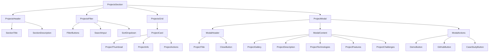

# Projects Showcase Component Design

## Component Overview

The Projects showcase component displays the developer's portfolio projects in an interactive, filterable grid with detailed project modals for comprehensive project information.

## Component Architecture

### Component Hierarchy


### Component Structure
```typescript
interface ProjectsSectionProps {
  projects: Project[];
  categories: ProjectCategory[];
  onProjectSelect: (project: Project) => void;
  onProjectClose: () => void;
  selectedProject?: Project;
}

interface Project {
  id: string;
  title: string;
  description: string;
  longDescription: string;
  category: ProjectCategory;
  technologies: string[];
  images: {
    thumbnail: string;
    screenshots: string[];
    hero?: string;
  };
  links: {
    demo?: string;
    github: string;
    caseStudy?: string;
  };
  features: string[];
  challenges: string[];
  results?: string[];
  date: string;
  status: 'completed' | 'in-progress' | 'archived';
  featured: boolean;
  tags: string[];
}

interface ProjectCategory {
  id: string;
  name: string;
  color: string;
  icon: string;
}

interface ProjectCardProps {
  project: Project;
  onClick: () => void;
  onActionClick: (action: 'demo' | 'github' | 'caseStudy') => void;
}

interface ProjectModalProps {
  project: Project;
  isOpen: boolean;
  onClose: () => void;
  onActionClick: (action: 'demo' | 'github' | 'caseStudy') => void;
}
```

## Design Specifications

### Layout Design

#### Desktop Layout (1024px+)
```css
.projects-section {
  padding: 6rem 2rem;
  max-width: 1400px;
  margin: 0 auto;
}

.projects-header {
  text-align: center;
  margin-bottom: 4rem;
}

.projects-filter {
  display: flex;
  justify-content: center;
  align-items: center;
  gap: 2rem;
  margin-bottom: 3rem;
  flex-wrap: wrap;
}

.projects-grid {
  display: grid;
  grid-template-columns: repeat(auto-fit, minmax(350px, 1fr));
  gap: 2rem;
  margin-bottom: 4rem;
}
```

#### Tablet Layout (768px - 1023px)
```css
.projects-grid {
  grid-template-columns: repeat(auto-fit, minmax(300px, 1fr));
  gap: 1.5rem;
}

.projects-filter {
  gap: 1rem;
}
```

#### Mobile Layout (< 768px)
```css
.projects-section {
  padding: 4rem 1rem;
}

.projects-grid {
  grid-template-columns: 1fr;
  gap: 1rem;
}

.projects-filter {
  flex-direction: column;
  gap: 1rem;
}
```

### Project Card Design

#### Card Layout
```css
.project-card {
  background: var(--surface);
  border-radius: 1rem;
  overflow: hidden;
  border: 1px solid var(--border);
  transition: all 0.3s ease;
  cursor: pointer;
  position: relative;
}

.project-card:hover {
  transform: translateY(-4px);
  box-shadow: 0 8px 25px rgba(0, 0, 0, 0.15);
  border-color: var(--primary);
}

.project-thumbnail {
  position: relative;
  width: 100%;
  height: 200px;
  overflow: hidden;
}

.project-thumbnail img {
  width: 100%;
  height: 100%;
  object-fit: cover;
  transition: transform 0.3s ease;
}

.project-card:hover .project-thumbnail img {
  transform: scale(1.05);
}

.project-info {
  padding: 1.5rem;
}

.project-title {
  font-size: var(--text-xl);
  font-weight: 600;
  color: var(--text-primary);
  margin-bottom: 0.5rem;
  line-height: 1.3;
}

.project-description {
  font-size: var(--text-sm);
  color: var(--text-secondary);
  line-height: 1.5;
  margin-bottom: 1rem;
  display: -webkit-box;
  -webkit-line-clamp: 3;
  -webkit-box-orient: vertical;
  overflow: hidden;
}

.project-technologies {
  display: flex;
  flex-wrap: wrap;
  gap: 0.5rem;
  margin-bottom: 1rem;
}

.technology-tag {
  background: var(--primary);
  color: white;
  padding: 0.25rem 0.75rem;
  border-radius: 1rem;
  font-size: var(--text-xs);
  font-weight: 500;
}

.project-actions {
  display: flex;
  gap: 0.75rem;
  justify-content: space-between;
}

.project-action-btn {
  flex: 1;
  padding: 0.75rem 1rem;
  border-radius: 0.5rem;
  font-size: var(--text-sm);
  font-weight: 500;
  text-align: center;
  transition: all 0.2s ease;
  border: 1px solid var(--border);
  background: var(--background);
  color: var(--text-primary);
}

.project-action-btn:hover {
  background: var(--primary);
  color: white;
  border-color: var(--primary);
}
```

### Filter System Design

#### Filter Buttons
```css
.filter-buttons {
  display: flex;
  gap: 0.5rem;
  flex-wrap: wrap;
  justify-content: center;
}

.filter-btn {
  padding: 0.75rem 1.5rem;
  border-radius: 2rem;
  font-size: var(--text-sm);
  font-weight: 500;
  border: 2px solid var(--border);
  background: var(--background);
  color: var(--text-primary);
  cursor: pointer;
  transition: all 0.2s ease;
}

.filter-btn:hover {
  border-color: var(--primary);
  color: var(--primary);
}

.filter-btn.active {
  background: var(--primary);
  color: white;
  border-color: var(--primary);
}

.search-input {
  padding: 0.75rem 1rem;
  border: 2px solid var(--border);
  border-radius: 0.5rem;
  font-size: var(--text-sm);
  background: var(--background);
  color: var(--text-primary);
  min-width: 200px;
}

.search-input:focus {
  outline: none;
  border-color: var(--primary);
}
```

### Project Modal Design

#### Modal Layout
```css
.project-modal {
  position: fixed;
  top: 0;
  left: 0;
  right: 0;
  bottom: 0;
  background: rgba(0, 0, 0, 0.8);
  display: flex;
  align-items: center;
  justify-content: center;
  z-index: 1000;
  padding: 2rem;
}

.modal-content {
  background: var(--background);
  border-radius: 1rem;
  max-width: 900px;
  max-height: 90vh;
  overflow-y: auto;
  position: relative;
  box-shadow: 0 20px 50px rgba(0, 0, 0, 0.3);
}

.modal-header {
  padding: 2rem 2rem 1rem;
  border-bottom: 1px solid var(--border);
  position: relative;
}

.modal-title {
  font-size: var(--text-3xl);
  font-weight: 700;
  color: var(--text-primary);
  margin-bottom: 0.5rem;
}

.modal-close {
  position: absolute;
  top: 1rem;
  right: 1rem;
  width: 2rem;
  height: 2rem;
  border: none;
  background: none;
  cursor: pointer;
  border-radius: 50%;
  display: flex;
  align-items: center;
  justify-content: center;
  transition: background 0.2s ease;
}

.modal-close:hover {
  background: var(--surface);
}

.modal-body {
  padding: 2rem;
}

.project-gallery {
  margin-bottom: 2rem;
}

.gallery-main {
  width: 100%;
  height: 400px;
  border-radius: 0.5rem;
  overflow: hidden;
  margin-bottom: 1rem;
}

.gallery-main img {
  width: 100%;
  height: 100%;
  object-fit: cover;
}

.gallery-thumbnails {
  display: flex;
  gap: 0.5rem;
  overflow-x: auto;
}

.gallery-thumbnail {
  width: 80px;
  height: 60px;
  border-radius: 0.25rem;
  overflow: hidden;
  cursor: pointer;
  border: 2px solid transparent;
  transition: border-color 0.2s ease;
}

.gallery-thumbnail.active {
  border-color: var(--primary);
}

.gallery-thumbnail img {
  width: 100%;
  height: 100%;
  object-fit: cover;
}

.project-details {
  display: grid;
  grid-template-columns: 2fr 1fr;
  gap: 2rem;
  margin-bottom: 2rem;
}

.project-description-full {
  font-size: var(--text-base);
  line-height: 1.6;
  color: var(--text-primary);
  margin-bottom: 2rem;
}

.project-meta {
  background: var(--surface);
  padding: 1.5rem;
  border-radius: 0.5rem;
  border: 1px solid var(--border);
}

.meta-section {
  margin-bottom: 1.5rem;
}

.meta-section:last-child {
  margin-bottom: 0;
}

.meta-title {
  font-size: var(--text-sm);
  font-weight: 600;
  color: var(--text-primary);
  margin-bottom: 0.5rem;
  text-transform: uppercase;
  letter-spacing: 0.05em;
}

.meta-content {
  font-size: var(--text-sm);
  color: var(--text-secondary);
  line-height: 1.5;
}

.modal-actions {
  padding: 1rem 2rem 2rem;
  display: flex;
  gap: 1rem;
  justify-content: center;
}

.modal-action-btn {
  padding: 1rem 2rem;
  border-radius: 0.5rem;
  font-size: var(--text-base);
  font-weight: 600;
  text-decoration: none;
  text-align: center;
  transition: all 0.2s ease;
  min-width: 120px;
}

.modal-action-btn.primary {
  background: var(--primary);
  color: white;
  border: 2px solid var(--primary);
}

.modal-action-btn.primary:hover {
  background: var(--primary-dark);
  border-color: var(--primary-dark);
}

.modal-action-btn.secondary {
  background: transparent;
  color: var(--primary);
  border: 2px solid var(--primary);
}

.modal-action-btn.secondary:hover {
  background: var(--primary);
  color: white;
}
```

## Interactive Elements

### Hover Effects
```css
.project-card:hover {
  transform: translateY(-4px);
  box-shadow: 0 8px 25px rgba(0, 0, 0, 0.15);
}

.project-card:hover .project-thumbnail img {
  transform: scale(1.05);
}

.filter-btn:hover {
  border-color: var(--primary);
  color: var(--primary);
}

.gallery-thumbnail:hover {
  border-color: var(--primary);
}
```

### Animation States
```css
@keyframes fadeInUp {
  from {
    opacity: 0;
    transform: translateY(20px);
  }
  to {
    opacity: 1;
    transform: translateY(0);
  }
}

.project-card {
  animation: fadeInUp 0.6s ease-out;
  animation-fill-mode: both;
}

.project-card:nth-child(1) { animation-delay: 0.1s; }
.project-card:nth-child(2) { animation-delay: 0.2s; }
.project-card:nth-child(3) { animation-delay: 0.3s; }
.project-card:nth-child(4) { animation-delay: 0.4s; }

@keyframes modalSlideIn {
  from {
    opacity: 0;
    transform: scale(0.9) translateY(20px);
  }
  to {
    opacity: 1;
    transform: scale(1) translateY(0);
  }
}

.modal-content {
  animation: modalSlideIn 0.3s ease-out;
}
```

### Loading States
```css
.project-card.loading {
  background: var(--surface);
  animation: pulse 1.5s ease-in-out infinite;
}

@keyframes pulse {
  0%, 100% {
    opacity: 1;
  }
  50% {
    opacity: 0.5;
  }
}

.skeleton {
  background: linear-gradient(90deg, var(--surface) 25%, var(--border) 50%, var(--surface) 75%);
  background-size: 200% 100%;
  animation: loading 1.5s infinite;
}

@keyframes loading {
  0% {
    background-position: 200% 0;
  }
  100% {
    background-position: -200% 0;
  }
}
```

## Responsive Behavior

### Mobile Modal Optimization
```css
@media (max-width: 768px) {
  .project-modal {
    padding: 1rem;
  }
  
  .modal-content {
    max-height: 95vh;
  }
  
  .project-details {
    grid-template-columns: 1fr;
    gap: 1rem;
  }
  
  .gallery-main {
    height: 250px;
  }
  
  .modal-actions {
    flex-direction: column;
  }
  
  .modal-action-btn {
    width: 100%;
  }
}
```

### Touch Optimization
```css
.project-card {
  touch-action: manipulation;
}

.project-action-btn {
  min-height: 44px;
  touch-action: manipulation;
}

.filter-btn {
  min-height: 44px;
  touch-action: manipulation;
}
```

## Accessibility Features

### Semantic HTML Structure
```html
<section id="projects" aria-labelledby="projects-heading">
  <h2 id="projects-heading" class="section-title">Featured Projects</h2>
  
  <div class="projects-filter" role="group" aria-label="Project filters">
    <button class="filter-btn active" aria-pressed="true" data-filter="all">
      All Projects
    </button>
    <button class="filter-btn" aria-pressed="false" data-filter="frontend">
      Frontend
    </button>
  </div>
  
  <div class="projects-grid" role="grid" aria-label="Project showcase">
    <article class="project-card" role="gridcell" tabindex="0">
      <div class="project-thumbnail">
        
      </div>
      <div class="project-info">
        <h3 class="project-title">[Project Name]</h3>
        <p class="project-description">[Project description]</p>
        <div class="project-technologies" role="list" aria-label="Technologies used">
          <span class="technology-tag" role="listitem">React</span>
          <span class="technology-tag" role="listitem">TypeScript</span>
        </div>
        <div class="project-actions">
          <button class="project-action-btn" aria-label="View demo of [Project Name]">
            Demo
          </button>
          <button class="project-action-btn" aria-label="View source code on GitHub">
            GitHub
          </button>
        </div>
      </div>
    </article>
  </div>
</section>
```

### ARIA Labels and Roles
- **Grid Role**: Use `role="grid"` for project layout
- **Button States**: Use `aria-pressed` for filter buttons
- **Modal Dialog**: Use `role="dialog"` for project modal
- **Image Alt Text**: Descriptive alt text for all project images

### Keyboard Navigation
- **Tab Order**: Logical tab sequence through projects
- **Enter/Space**: Activate project cards and buttons
- **Escape**: Close modal dialog
- **Arrow Keys**: Navigate between projects (optional enhancement)

## Performance Considerations

### Image Optimization
```typescript
// Next.js Image component usage
import Image from 'next/image';

<Image
  src="/projects/project-thumb.jpg"
  alt="Project thumbnail"
  width={400}
  height={200}
  className="project-thumbnail"
  loading="lazy"
  placeholder="blur"
  blurDataURL="data:image/jpeg;base64,..."
/>
```

### Lazy Loading Strategy
- **Thumbnails**: Load project thumbnails on scroll
- **Modal Images**: Load full-size images when modal opens
- **Progressive Enhancement**: Show skeleton loaders during loading

### Code Splitting
```typescript
// Dynamic imports for modal content
const ProjectModal = dynamic(() => import('./ProjectModal'), {
  loading: () => <ModalSkeleton />,
});

const ProjectGallery = dynamic(() => import('./ProjectGallery'), {
  loading: () => <GallerySkeleton />,
});
```

## Content Management

### Project Data Structure
```json
{
  "projects": [
    {
      "id": "ecommerce-platform",
      "title": "E-commerce Platform",
      "description": "Full-stack e-commerce solution with modern UI and payment integration",
      "longDescription": "A comprehensive e-commerce platform built with React and Node.js, featuring user authentication, product management, shopping cart functionality, and secure payment processing through Stripe. The application includes an admin dashboard for inventory management and order tracking.",
      "category": {
        "id": "fullstack",
        "name": "Full Stack",
        "color": "#3b82f6",
        "icon": "layers"
      },
      "technologies": ["React", "Node.js", "MongoDB", "Stripe", "Tailwind CSS"],
      "images": {
        "thumbnail": "/projects/ecommerce-thumb.jpg",
        "screenshots": [
          "/projects/ecommerce-1.jpg",
          "/projects/ecommerce-2.jpg",
          "/projects/ecommerce-3.jpg"
        ],
        "hero": "/projects/ecommerce-hero.jpg"
      },
      "links": {
        "demo": "https://ecommerce-demo.vercel.app",
        "github": "https://github.com/username/ecommerce-platform",
        "caseStudy": "/case-studies/ecommerce-platform"
      },
      "features": [
        "User authentication and authorization",
        "Product catalog with search and filtering",
        "Shopping cart and checkout process",
        "Payment integration with Stripe",
        "Admin dashboard for management",
        "Responsive design for all devices"
      ],
      "challenges": [
        "Implementing secure payment processing",
        "Optimizing database queries for performance",
        "Creating intuitive admin interface",
        "Ensuring mobile responsiveness"
      ],
      "results": [
        "40% faster page load times",
        "99.9% uptime achieved",
        "95% user satisfaction rating",
        "50% increase in conversion rate"
      ],
      "date": "2023-08-15",
      "status": "completed",
      "featured": true,
      "tags": ["ecommerce", "react", "nodejs", "mongodb", "stripe"]
    }
  ],
  "categories": [
    {
      "id": "frontend",
      "name": "Frontend",
      "color": "#10b981",
      "icon": "monitor"
    },
    {
      "id": "fullstack",
      "name": "Full Stack",
      "color": "#3b82f6",
      "icon": "layers"
    },
    {
      "id": "mobile",
      "name": "Mobile",
      "color": "#f59e0b",
      "icon": "smartphone"
    },
    {
      "id": "design",
      "name": "Design",
      "color": "#8b5cf6",
      "icon": "palette"
    }
  ]
}
```

## Testing Strategy

### Unit Tests
- Component rendering with different project data
- Filter functionality testing
- Modal open/close behavior
- Search functionality testing

### Integration Tests
- Project data flow from props to rendered cards
- Modal content population
- Filter state management
- Action button interactions

### Visual Regression Tests
- Project card layouts across breakpoints
- Modal appearance and behavior
- Filter button states
- Loading state animations

## Implementation Checklist

### Development Phase
- [ ] Create project card component
- [ ] Implement filter and search functionality
- [ ] Build project modal with gallery
- [ ] Add responsive design and animations
- [ ] Implement accessibility features

### Testing Phase
- [ ] Unit tests for all components
- [ ] Integration tests for data flow
- [ ] Accessibility testing with screen readers
- [ ] Cross-browser compatibility testing
- [ ] Performance testing and optimization

### Content Phase
- [ ] Prepare project screenshots and thumbnails
- [ ] Write compelling project descriptions
- [ ] Gather technology stack information
- [ ] Create project case studies
- [ ] Optimize images for web performance
